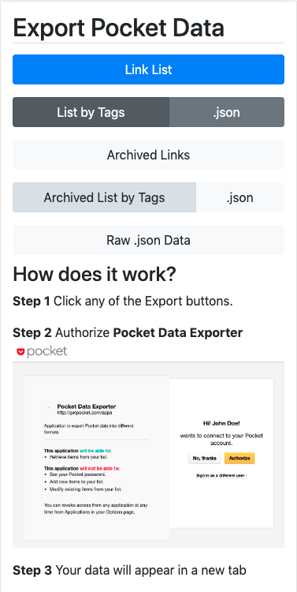

# Pocket Data Exporter  

Pocket can export user data in a single html.  
**Pocket Data Exporter** can export the data in a richer array of formats.  



# Development  

1- Create a pocket app  
2- Create an environment file  

```bash
cat <<EOF >> .env
CONSUMER_KEY=your-app-consumer-key
DEBUG=false
EOF
```

3- Run the app  

```bash
dotenv thin --threaded start
```


## Utils

```bash
ruby ./utils/parser_list_only.rb ~/Downloads/pocket_data.json
ruby ./utils/parser_list_by_tag.rb ~/Downloads/pocket_data.json
```

## Docs  
- https://getpocket.com/developer/docs/v3/retrieve
- https://getpocket.com/connected_applications
